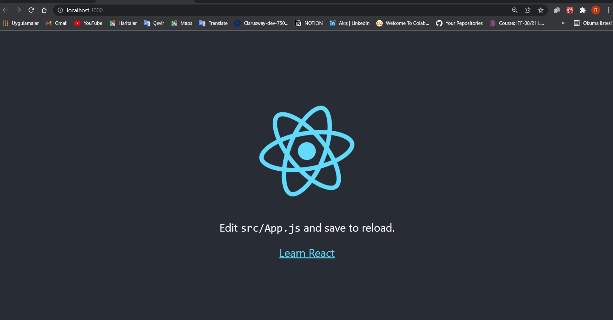
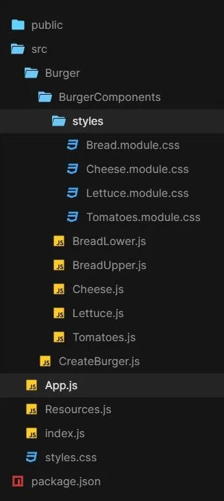

   1 npm install -g create-react-app
   2 create-react-app my-app
   3 cd my-app
   4 npm start
   
   ## Adım adım React JS örnek projesi

   Bu yazımızda adım adım React.js'de örnek proje oluşturmayı öğreneceğiz. Create-react-app kitaplığının kurulumundan başlayıp, sunucudaki dosyaların dağıtımına doğru ilerleyeceğiz. Bu yazı, bir dizi kod örneğini ve canlı demoları içerecektir. Hadi başlayalım.

   ## Burger Sipariş Uygulaması

   Bir Burger oluşturma ve sipariş uygulaması oluşturacağız. Bu uygulamada, kullanıcı burgerlerini peynir, domates, et, marul vb. miktarı gibi kişiselleştirebilir ve ardından sipariş verebilir. 
   Ele alacağımız başlıca işlevler şunlardır:

         Dividing app into reusable functional components.
         States and Props.
         Creating HTML forms in Reactjs.
         Making a server API call.
         Displaying images and other UI using JSX.
         Rendering DOM.
         Showing lists using pagination.
         And many more…

         Uygulamayı yeniden kullanılabilir işlevsel bileşenlere bölme.
         States and Props.
         Reactjs'de HTML formları oluşturma.
         Bir sunucu API çağrısı yapma.
         JSX kullanarak görüntüleri ve diğer kullanıcı arayüzünü görüntüleme.
         DOM oluşturma.
         Sayfalandırma kullanılarak listeler gösteriliyor.
         Ve daha fazlası…

Bu projeyi seçmeye karar verdim çünkü neredeyse tüm projelerinizde ihtiyaç duyacağınız birçok temel işlevi içeriyor. Bu size ekosistemin nasıl çalıştığını, hangi hatalarla karşılaşabileceğinizi ve Vanilla JS'den nasıl farklı olduğunu gösterecektir.

## Step 1: Installing create-react-app

   Herhangi bir React projesi için, ilk adım create-react-app npm paketini kurmaktır (önceden kurulu değilse). Bu paket, bir React uygulaması için tüm ilk kurulumları yapar.

   Oyuncuların sahne alacağı bir sahne dekoratörü olarak düşünün. Sahne olmadan oyuncular performans gösteremezler.
Yani, iki seçeneğiniz var
– Ya 10 farklı görev için sahne dekorasyon işini 10 farklı kişiye verin ya da tüm işi yapacak tek bir müteahhit kiralayabilirsiniz.
  Benzer şekilde, ortamı kendiniz manuel olarak ayarlayabilir veya create-react-app yardımcı programını kullanabilirsiniz. Ama paket sizin için tüm ayarları yapabilecekken neden yükü üstleniyorsunuz?

## create-react-app yüklemek için sözdizimi -

 ## npx install -g create-react-app
 
## Step 2: Creating Burger Project

create-react-app paketini kurduktan sonra projemizi oluşturmak için kullanabiliriz. 
Önceki bölümde söylediğim gibi, tüm kurulumların olduğu bir sahneye ihtiyacımız var. Öyleyse bu komutu çalıştırın -

## npx create-react-app my-app
## cd my-app
## npm start

Projemiz olan my-app adında bir dizin oluşturacak. 
Tüm dosyalar, kaynaklar, kitaplıklar, paketler vb. sadece bu dizinde olacaktır.
CD kullanarak proje dizinimizin my-app girebiliriz. 
npm start yerel sunucuyu çalıştıracak ve uygulamamızı tarayıcıda görebileceğiz. 
Şu anda, reactjs tarafından oluşturulan varsayılan bir sayfa gösterecektir.

## Overview

## Step 3: Understanding the code flow [Kod akışını anlama]

İyi bir kod tabanı için kodun ne zaman ve nasıl yeniden düzenlenmesi gerektiğini bilmeniz gerekir.
Bir kodu yeniden kullanılabilir bileşenlere ayırmak, deneyimle ustalaşacağınız bir sanattır.
Bunun için önceden tanımlanmış kurallar yoktur ve her proje farklı bir yaklaşım gerektirir.

Projemizde bir burger yaratacağız. Çok temel şeyler onun bileşenleridir. Peki, size sorayım, bir burger ne içerir? Cevabı biliyorsun ve malzemeleri yazıyorum –
Üst Ekmek
Alt Ekmek
Domates
Marul
Peynir
patates pirzola
Et
Diğer şey..

İkincisi, hamburger nasıl hazırlanır? Peki, alt ekmek – marul – domates – peynir – domates – marul – üst ekmek. Bu doğru mu? Benimle aynı fikirde olmayacaksın, eminim. Çünkü bu tamamen tercihle ilgili ve bu yüzden burgerimizin müşterilerin tercihlerine göre özelleştirilebilir olması gerekiyor.

Özelleştirilebilir bir şey yaratmak için, gerektiğinde onları arayabilmemiz için onu ayrı bileşenlere ayırmamız gerekir.
Burada müşterinin tercihine göre farklı burger malzemelerini üst üste koymamız gerekiyor.

Bunun gibi bir klasör yapısı buldum -

## Overview

## deployment
npm run-script build
yarn build

cd build
surge
